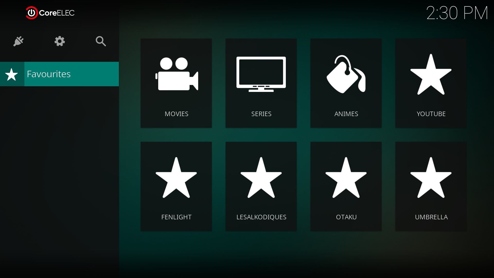
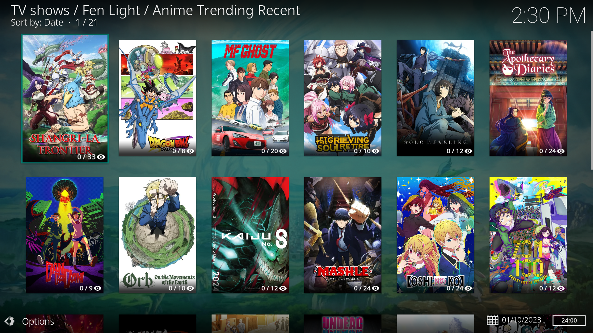

# <samp>OVERVIEW</samp>

CoreELEC automatic setup for minimalists.



# <samp>GUIDANCE</samp>

Blindly executing this is strongly discouraged.

```shell
wget -qO- https://raw.githubusercontent.com/olankens/corhogen/HEAD/corhogen.sh | bash
```
